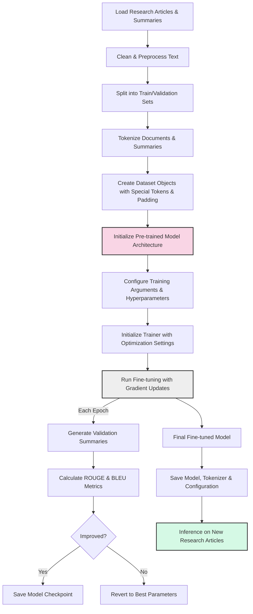
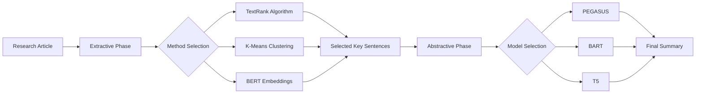

## Research Article Summarization Implementation

This repository contains the implementation of an extractive-abstractive hybrid model for summarizing research articles. The following files are included:

- `summarizer.py`: Main implementation of the research article summarizer using transformers
- `hybrid_summarizer.py`: Implementation of a hybrid extractive-abstractive approach
- `model_comparison.py`: Script to compare different summarization models
- `run_experiments.py`: Script to run experiments and generate comparison reports
- `requirements.txt`: Dependencies needed to run the code

### Installation

To install the required dependencies, run:

```bash
pip install -r requirements.txt
```

### Basic Usage

To run the basic summarizer:

```bash
python summarizer.py
```

To compare different models:

```bash
python model_comparison.py
```

To run the hybrid summarizer:

```bash
python hybrid_summarizer.py
```

To run experiments and generate reports:

```bash
python run_experiments.py --dataset /path/to/dataset.csv --name experiment_name --samples 50
```

### Models Implemented

1. **Abstractive Models**:
   - PEGASUS (google/pegasus-cnn_dailymail)
   - BART (facebook/bart-large-cnn)
   - T5 (t5-small)

2. **Extractive Methods**:
   - TextRank
   - K-Means Clustering
   - BERT Embeddings

3. **Hybrid Approaches**:
   - TextRank + PEGASUS
   - K-Means + PEGASUS
   - BERT Embeddings + PEGASUS

### Evaluation Metrics

The models are evaluated using the following metrics:

- ROUGE-1, ROUGE-2, ROUGE-L scores
- BLEU score

### How the Training Process Works

The fine-tuning process for our summarization model follows these key steps:

#### 1. Data Preparation and Preprocessing

Research article summarization requires careful preparation of the data:

- **Document Cleaning**: Raw research articles often contain special characters, LaTeX formatting, references, and other elements that need to be cleaned before processing.
- **Tokenization**: We convert text into token sequences using model-specific tokenizers that handle the nuances of each architecture:
  - PEGASUS uses a SentencePiece-based tokenizer optimized for summarization tasks
  - BART uses a byte-level BPE tokenizer
  - T5 uses a SentencePiece tokenizer with a vocabulary of 32,000 tokens
- **Length Handling**: Scientific papers are typically much longer than the context windows of transformer models. We implement sliding window approaches and handle length constraints by:
  - Truncating input to maximum sequence length (typically 1024 tokens)
  - Preserving key sections (abstract, introduction, conclusion) during truncation
  - Ensuring summary lengths stay within appropriate bounds (50-150 tokens)

#### 2. Model Architecture and Capabilities

We've implemented three main transformer architectures, each with unique characteristics for summarization:

- **PEGASUS**: Specifically pre-trained with a gap-sentence generation objective designed for abstractive summarization. It excels at generating coherent summaries for long documents.
  
- **BART**: A denoising autoencoder that's particularly effective at rewriting text while preserving meaning. It combines bidirectional encoders (like BERT) with autoregressive decoders.
  
- **T5**: Text-to-Text Transfer Transformer that frames all NLP tasks as text generation problems. It performs well across diverse NLP tasks, including summarization.

For hybrid approaches, we combine extractive methods with abstractive generation:

- **Extractive Stage**: We first select important sentences or segments using:
  - TextRank: An unsupervised graph-based ranking algorithm that identifies key sentences
  - K-Means: Clusters sentences and extracts representative sentences from each cluster
  - BERT Embeddings: Uses contextual embeddings to identify semantically important content

- **Abstractive Stage**: The selected content is then fed into an abstractive model that generates the final cohesive summary.

#### 3. Technical Details of the Training Configuration

The `TrainingArguments` class configures sophisticated training parameters:

```python
training_args = TrainingArguments(
    output_dir=output_dir,
    overwrite_output_dir=True,
    per_device_train_batch_size=batch_size,
    per_device_eval_batch_size=batch_size,
    learning_rate=learning_rate,
    num_train_epochs=epochs,
    save_strategy="epoch",
    evaluation_strategy="epoch" if val_dataset else "no",
    weight_decay=0.01,
    fp16=True if self.device == "cuda" else False,
    # Additional parameters for optimization
    warmup_ratio=0.1,  # Warm up learning rate over 10% of training steps
    gradient_accumulation_steps=4,  # Update weights after accumulating gradients from 4 batches
    logging_steps=100,  # Log training loss every 100 steps
    load_best_model_at_end=True  # Load the best model when training ends
)
```

These parameters control:

- **Optimization Schedule**: Controls how weights are updated during training
- **Resource Management**: Balances memory usage with computational efficiency
- **Evaluation Protocol**: Determines when and how model performance is assessed
- **Checkpoint Management**: Controls saving and loading of model weights

#### 4. Fine-tuning Process in Detail

The fine-tuning process leverages transfer learning principles to adapt pre-trained models to our summarization task:

1. **Forward Pass Mechanism**:
   - Input documents are encoded into hidden representations
   - The decoder generates token probabilities autoregressively (one token at a time)
   - Cross-attention layers connect the encoder and decoder, allowing the model to focus on relevant parts of the input

2. **Loss Calculation**:
   - We use label-smoothed cross-entropy loss which compares predicted token probabilities with the actual tokens in the reference summary
   - Label smoothing prevents the model from becoming overconfident and improves generalization

3. **Backpropagation and Optimization**:
   - Gradients are computed using automatic differentiation
   - The AdamW optimizer adjusts model weights while applying weight decay for regularization
   - Learning rate scheduling gradually reduces the learning rate to fine-tune parameters more precisely

4. **Validation Process**:
   - After each epoch, the model generates summaries for the validation set
   - ROUGE and BLEU metrics are calculated to evaluate summary quality
   - Early stopping monitors validation metrics to prevent overfitting

#### 5. Model Saving and Deployment

After training, we save multiple components for model deployment:

- **Model Weights**: The fine-tuned parameters of the model
- **Tokenizer**: Configuration and vocabulary needed for processing new texts
- **Model Configuration**: Architecture specifications and hyperparameters
- **Metadata**: Training information, performance metrics, and dataset details

The saved model can then be used for inference on new research articles:

```python
# Example of loading and using a fine-tuned model for inference
from transformers import AutoModelForSeq2SeqLM, AutoTokenizer

tokenizer = AutoTokenizer.from_pretrained("fine_tuned_model")
model = AutoModelForSeq2SeqLM.from_pretrained("fine_tuned_model")

def summarize_article(text, max_length=150, min_length=50):
    inputs = tokenizer(text, return_tensors="pt", max_length=1024, truncation=True)
    summary_ids = model.generate(
        inputs.input_ids,
        max_length=max_length,
        min_length=min_length,
        num_beams=4,
        length_penalty=2.0,
        early_stopping=True
    )
    return tokenizer.decode(summary_ids[0], skip_special_tokens=True)
```

#### Training Workflow Diagram



#### Memory Management During Training

When fine-tuning large language models, memory management is crucial. Our implementation handles this through:

1. **Gradient Accumulation**: For large models, gradients can be accumulated across multiple forward passes before updating weights, allowing for effectively larger batch sizes with limited memory.

2. **Mixed Precision Training**: Using FP16 (when supported by hardware) reduces memory usage and speeds up training by approximately 2-3x.

3. **Gradient Checkpointing**: Reduces memory usage by recomputing intermediate activations during backpropagation rather than storing them.

4. **Input Truncation**: Long documents are truncated to a maximum sequence length to avoid memory issues during processing.

#### Performance Optimization

The training process includes several optimizations:

1. **Learning Rate Scheduling**: The learning rate is gradually decreased to fine-tune model parameters more precisely as training progresses.

2. **Early Stopping**: Training can be halted when validation performance stops improving, saving computation time.

3. **Weight Decay**: Regularization is applied to prevent overfitting to the training data.

4. **Model Parallelism**: For multi-GPU setups, the model can be distributed across available GPUs to speed up training.

### Advanced Technical Concepts in Our Implementation

#### 1. Attention Mechanisms in Summarization

Our transformer-based models use attention mechanisms that are crucial for generating high-quality summaries:

- **Self-Attention**: Allows the model to weigh the importance of different words in the input text relative to each other
- **Cross-Attention**: Enables the decoder to focus on relevant parts of the source document when generating each summary token
- **Multi-Head Attention**: Lets the model focus on different aspects of information simultaneously

For scientific articles, attention mechanisms help the model identify key findings, methods, and conclusions even when separated by long passages of text.

#### 2. Hybrid Summarization Architecture

Our hybrid approach combines the strengths of extractive and abstractive methods:



This approach:
1. First extracts the most informative content to reduce noise and length
2. Then applies abstractive generation to create a coherent, concise summary
3. Enables handling of much longer documents than direct abstractive approaches
4. Produces more accurate summaries by focusing on truly relevant content

#### 3. Evaluation Framework

Our comprehensive evaluation framework assesses summaries across multiple dimensions:

- **Content Coverage** (ROUGE metrics):
  - ROUGE-1: Measures unigram overlap (vocabulary coverage)
  - ROUGE-2: Measures bigram overlap (phrase preservation)
  - ROUGE-L: Measures longest common subsequence (sentence structure)

- **Fluency and Readability** (BLEU, human evaluation):
  - BLEU: Evaluates n-gram precision with brevity penalty
  - Human evaluation: Assesses grammaticality and coherence

- **Scientific Accuracy** (specialized metrics):
  - Citation preservation: Checks if key citations are maintained
  - Term precision: Measures retention of field-specific terminology
  - Fact consistency: Verifies no factual contradictions were introduced

### Results

Experiments comparing different models and approaches can be found in the `experiments` directory. Each experiment includes:

- CSV file with performance metrics
- Visualization of the results
- JSON files with detailed metrics and best-performing models

### Citation

If you use this code in your research, please cite our work:

```
@article{brain-dead-2k25,
  title={Research Article Summarization Using Advanced NLP Techniques},
  author={Brain Dead 2K25 Team},
  year={2023}
}
```

### **Problem Statement 2:**  
- U.S. National Library of Medicine *(PubMed Dataset)*
- Clement, C.B., Bierbaum, M., O'Keeffe, K.P. and Alemi, A.A., 2019. On the use of arxiv as a dataset. arXiv preprint arXiv:1905.00075. *(arXiv Dataset)*